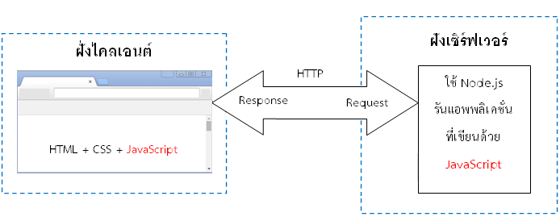
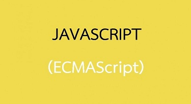
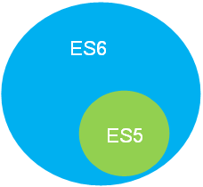
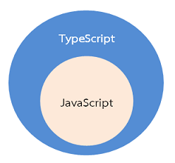
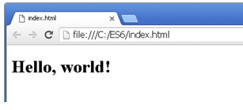
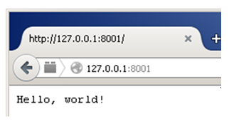

# JavaScript ยุคสมัยใหม่


## เนื้อหาเกี่ยวกับอะไร

เหตุผลที่เขียนบทความชุดนี้ เพราะหลังจากเขียนหนังสือเล่มดังกล่าวไปแล้ว (ตามรูปข้างบน) เทคโนโลยีจาวาสคริปต์ก็ดูเหมือนพัฒนาต่อเนื่อง (ยังไม่นิ่ง)
ด้วยเหตุนี้ ....

* เนื้อหาทั้งหมดต่อไปนี้ จะเหมือนเป็นภาคต่อจากหนังสือดังกล่าว
* จะทบทวนจาวาสคริปต์ตามมาตรฐานเก่า ES5 นิดหน่อย
* จะเป็นการพาทัวร์ภาษาจาวาสคริปต์ (JavaScript) ยุคสมัยใหม่ตามมาตรฐาน ES6
* จะพูดถึงภาษาจาวาสคริปต์ (JavaScript) ยุคสมัยใหม่ตามมาตรฐาน ES7, ES8
* รวมทั้งเพิ่มเนื้อหาที่ไม่อยู่ในหนังสืออีกมากมาย 
* ทั้งนี้เนื้อหาจะต่างจากหนังสือข้างต้น ไม่เหมือนกันซะเท่าไร
* ซึ่งตอนนี้ผมยังเขียนสรุปไม่เสร็จดี ว่างๆ ก็จะมาอัพเดตใหม่เรื่อยๆ 

*** เขียนเสร็จไปแล้ว 5%

*** ใครเอาเนื้อหาผมไปใช้ โปรดให้เครดิตลิงค์ต้นฉบับต้นด้วยนะคร๊าบบบบบ

ถ้าสนใจข่าวสารไอที ติดตามได้ที่เพจ

* https://www.facebook.com/programmerthai/

## ถ้าสนใจเล่มนี้สามารถสั่งซื้อได้ที่

* [ศูนย์หนังสือจุฬา]( http://www.chulabook.com/description.asp?barcode=9786160825394)
* [ร้านนายอินทร์](https://www.naiin.com/product/detail/191081/)
* [ร้าน Book Smile](http://www.booksmile.co.th/คอมพิวเตอร์อินเทอร์เน็ต/พัฒนาเว็บแอบพลิเคชั่นด้วย-JavaScript.html)
* [ร้าน kinokuniya thailand](https://thailand.kinokuniya.com/bw/9786160825394)
* [ผ่านฟ้าบุ๊คเซ็นเตอร์] (http://www.phanpha.com/item/พัฒนาเว็บแอปพลิเคชั่นด้วย-javascript)
* [ซีเอ็ดบางสาขา]( https://www.se-ed.com/product/พัฒนาเว็บแอปพลิเคชั่นด้วย-JavaScript.aspx?no=9786160825394)
* และร้านหนังสืออื่น ๆ ที่ไม่ได้กล่าว

## สารบัญ

* [บทที่ 1 แนะนำภาษาจาวาสคริปต์](#บทที่-1-แนะนำภาษาจาวาสคริปต์)
* [บทที่ 2 ทวน ES5 (มาตรฐานเก่า)](#บทที่-2-ทวน-es5-มาตรฐานเก่า)
* [บทที่ 3 แนะนำ ES6](#บทที่-3-แนะนำ-es6)
* [บทที่ 4 แนะนำ ES7](#บทที่-4-แนะนำ-es7)
* [บทที่ 5 แนะนำ ES8](#บทที่-5-แนะนำ-es8)

## บทที่ 1 แนะนำภาษาจาวาสคริปต์

### เกริ่นนำ

* ภาษาจาวาสคริปต์ (JavaScript) เป็นภาษาโปรแกรมเชิงวัตถุแบบไดนามิกไทป์ (Dynamic types) ซึ่งไวยากรณ์ของมันได้นำโครงสร้างมาจากภาษายอดนิยมอย่างจาวา (Java) กับภาษาซี (C) 

* โปรแกรมที่เขียนขึ้นด้วยจาวาสคริปต์ จะต้องทำงานอยู่บนจาวาสคริปต์เอ็นจิ้น (JavaScript engine) ที่เป็นทั้งตัวแปลภาษา (Interpreter) และใช้รันโปรแกรม สำหรับการทำงานของจาวาสคริปต์ที่เราคุ้นเคยกันดี จะทำงานอยู่บนเว็บเบราเซอร์ เช่น Google Chrome, Firefox และ Internet Explorer เป็นต้น ซึ่งจะมีจาวาสคริปต์เอ็นจิ้นติดตั้งมาให้อยู่แล้ว


* นักพัฒนาซอฟต์แวร์ส่วนใหญ่ล้วนรู้จักภาษาจาวาสคริปต์ ซึ่งถือว่านิยมใช้กันมากภาษาหนึ่งในโลก ถ้าศึกษาอย่างผิวเผินก็อาจคิดว่าง๊ายง่าย แต่เมื่อศึกษาลงลึก ๆ แล้ว จะพบว่ามันโคตรจะอินดี้ เป็นภาษาปราบเซียนตัวหนึ่ง จนคนไม่ค่อยเข้าใจกันมากเท่าไรนัก จนหารู้ไม่ว่ามันมีความสามารถแฝงที่ซ้อนเร้นอยู่เยอะเลย

* จาวาสคริปต์ไม่ใช่ภาษา Java นะครับ คนละภาษา (คนมักสับสนกัน) 


* คนส่วนใหญ่รู้แค่ว่าใช้จาวาสคริปต์ร่วมกับภาษา HTML (ปัจจุบันเวอร์ชั่น HTML5) กับ CSS (ปัจจุบันเวอร์ชั่น CSS3) เพื่อทำให้เว็บมันไดนามิก ฟุ้งฟิ้ง กรุ้งกิ๊ง (มันดังในฝั่ง Font-end มานาน)

* แต่ปัจจุบันนี้จาวาสคริปต์สมัยใหม่ มันก้าวหน้าไปไกลมาก ๆๆๆ เพราะสามารถทำงานอยู่ฝั่งเซิร์ฟเวอร์ได้ (Back-end) ด้วย Node.js แม้แต่เอาไปทำแอพบนโมบาย หรือแม้แต่โรบอท ก็ยังทำได้ด้วย ….อายย่ะ



* องค์กร Ecma International (องค์กรจัดการมาตรฐานแห่งยุโรป) เป็นผู้กำหนดมาตรฐานจาวาสคริปต์ ซึ่งจะเรียกมาตรฐานนี้ว่า “ECMA-262” ส่วนตัวภาษาจาวาสคริปต์นั้น ก็จะมีชื่อเรียกเต็มยศอย่างเป็นทางการว่า “ภาษา ECMAScript“



* ES6 (ECMAScript 2015) เป็นมาตรฐานใหม่ล่าสุดของจาวาสคริปต์ ประกาศออกมาเมื่อกลางเดือนมิถุนายนปี 2558 ซึ่งถือว่าเปลี่ยนแปลงเวอร์ชั่นครั้งใหญ่สุดในประวัติศาสตร์ของภาษานี้ หลังจากไม่ได้เปลี่ยนมาเกือบ 6 ปี (เวอร์ชั่นเก่าคือ ES5)



* ปีค.ศ. 2016 เวอร์ชั่นใหม่ ES7 (ECMAScript 2016) ก็ออกมาแหละ ส่วนปีหน้า 2017 ก็จะเป็นคิวของเวอร์ชั่น ES8 (ECMAScript 2017) จะออกมาเช่นกัน 

* ต้องเข้าใจอย่างนี้นะครัช เนื่อง ES6 มันใหญ่โตอลังการงานสร้างมาก คืนรอปล่อยออกมาหมดทีเดียว ก็คงรอหลายชาติภพ อาจทำให้มีเสียงบ่นตามมาได้ ด้วยเหตุนี้เข้าถึงเพิ่มฟีเจอร์เล็กยิบ ๆ ย่อย ๆ มาใส่ไว้ในเวอร์ชั่นหลัง ๆ แทน 

* โดยคาดว่าจากนี้ไป จะมีการประกาศเวอร์ชั่นใหม่ทุก ๆ ปี โดยให้คิดเสียว่า ES6 เหมือนโปรแกรมหลัก ส่วนเวอร์ชั่นที่ออกตามทีหลัง ไม่ได้ว่าจะเป็น ES7, ES8 และ ESXXXXX มันก็คือการอัพเดตซอฟต์แวร์ อะไรประมาณนี้


* API ที่ใช้ติดต่อกับ DOM หรือใช้งานร่วมกับ HTML5, CSS3 ใน ES6 เขาไม่ได้เปลี่ยนแปลงอะไรเลย

* ES6, ES7, ES8 มันเป็นแค่มาตรฐานใหม่สด ๆ ซิง ๆ ดังนั้นการใช้งานโดยตรงบนเว็บบราวเซอร์ (ปัจจุบันที่ผมเขียนอยู่นี้) ก็ยังไม่ support ทุกฟีเจอร์ ต้องมีตัวคอมไพล์ช่วยก่อน (ยังมีข้อจำกัดบางประการ) …แต่ถ้าใครใช้ Node.js เวอร์ชั่น 7 ขึ้นไป (ยังไม่ปล่อยออกมา) ถึงจะรองรับ ES6 ได้ 100% (ES7 รองรับได้บางส่วน)


* TypeScript เป็นภาษาดัดแปลงมาจากจาวาสคริปต์ โดยทั้งนี้ไวยากรณ์และฟีเจอร์ต่างๆ จะมากกว่า อาจมองว่าเป็นซุปเปอร์เซตของจาวาสคริปต์อีกที (แน่นอนมันครอบคลุม ES6) ซึ่งเจ้าของภาษาคือ Microsoft



### เครื่องมือในการพัฒนาจาวาสคริปต์

* มีให้ใช้ฟรีหลายตัวมาก เช่น Sublime Text, Atom, Free JavaScript Editor, Aptana Studio, NetBeans, Eclipse ฯลฯ 
* หรือแม้แต่ใช้อิดิเตอร์ธรรมดา เช่น Notepad, Notepad++ และ EditPlus เป็นต้น 

### Node.js มันคืออะไรตับไตใส้พุง?

ถ้าใครจับจาวาสคริปต์ยุคนี้ จะหนีไม่พ้นต้องรู้จัก Node.js …เอ๊ะ ว่าแต่มันคืออะไรล่ะ?

ถ้าอธิบายสั้นๆ มันคือตัวรันไทม์ (Runtime) ของภาษาจาวาสคริปต์ โดยที่เราไม่ต้องพึ่งพาเว็บบราวเซอร์เลย 

ด้วยเหตุนี้จึงสามารถรันจาวาสคริปต์นอกเว็บเบราเซอร์ได้ ซึ่งปัจจุบันเขานิยมนำ Node.js มาใช้งานฝั่งเซิร์ฟเวอร์ (Back-end) หรือจะทำงานตามลำพังเป็นแบบ Standalone ก็ย่อมได้นะลูกพี่

ถ้าสนใจเนื้อหาของ Node.js มากกว่านี้ ก็สามารถอ่าน ebook ที่ผมแจกฟรีได้ที่

* [วิธีติดตั้ง Node.js และ npm เบื้องต้น (Node.js เวอร์ชั่น 6)](http://ebooks.in.th/ebook/37385/วิธีติดตั้ง_Node.js_และ_npm_เบื้องต้น/)
* [Node.js เล่ม 1](http://www.ebooks.in.th/ebook/37714/เสียดายไม่ได้อ่าน_จาวาสคริปต์ฝั่งเซิร์ฟเวอร์_Node.js_(ฉบับย่อ)/)
* [Node.js เล่ม  2] (http://www.ebooks.in.th/ebook/37836/เสียดายไม่ได้อ่าน_จาวาสคริปต์ฝั่งเซิร์ฟเวอร์_Node.js_ฉบับย่อ_เล่ม2)
* [การใช้งาน MongoDB เบื้องต้น (แถมให้อีกอัน)](http://www.ebooks.in.th/ebook/37861/การใช้งาน_MongoDB_เบื้องต้น/)

*** ต้องสมัครเป็นสมาชิกของ http://www.ebooks.in.th ถึงจะโหลด PDF ได้


ถ้าใครขี้เกียจสมัครเป็นสมัครชิก ก็ให้ใช้ลิงค์ดังต่อไปนี้แทน

* http://www.ebooks.in.th/ebook/37385/วิธีติดตั้ง_Node.js_และ_npm_เบื้องต้น/
* http://www.ebooks.in.th/ebook/37714/เสียดายไม่ได้อ่าน_จาวาสคริปต์ฝั่งเซิร์ฟเวอร์_Node.js_(ฉบับย่อ)/
* http://www.ebooks.in.th/ebook/37836/เสียดายไม่ได้อ่าน_จาวาสคริปต์ฝั่งเซิร์ฟเวอร์_Node.js_ฉบับย่อ_เล่ม2/
* http://www.ebooks.in.th/ebook/37861/การใช้งาน_MongoDB_เบื้องต้น/
* เล่มอื่นเผื่อใครสนใจ http://www.ebooks.in.th/adminho/

###  ตัวอย่างจาวาสคริปต์บนเว็บเบราเซอร์ 

ตัวอย่างต่อไปนี้จะแสดงการเขียนจาวาสคริปต์ตามมาตรฐานเก่า ES5 ซึ่งจะต้องแทรกอยู่ภายใต้แท็ก < script > ...< /script > ของไฟล์ HTML โดยทั้งนี้จะสมมติว่าบันทึกเป็นไฟล์ index.html

*** ผมขอติ้งต่างว่า คุณเขียนจาวาสคริปต์บน HTML เป็นกันอยู่แล้วเนอะ

```js
<!-- ไฟล์ชื่อ index.html-->
<!DOCTYPE html>
<html>
<head></head>
<body>
	<h1 id="element1"></h1>
	<script>		
		// ซอร์สโค้ดตามมาตราฐานเก่า ES5   
		function say(message){
	    		var element = document.querySelector('#element1');
	    		element.innerHTML = message;			
		}
		say("Hello, world!");
</script>
</body>
</html>
```

โครงสร้างโปรเจค

```js
C:\ES6>
    |-- index.html
```

เมื่อดับเบิลคลิกที่ไฟล์ index.html จะปรากฏตามรูป



### ตัวอย่างจาวาสคริปต์นอกเว็บเบราเซอร์

ต่อไปจะแสดงการใช้งานจาวาสคริปต์นอกเว็บเบราเซอร์ ด้วยการใช้ Node.js รันไฟล์จาวาสคริปต์ในฝั่งเซิร์ฟเวอร์

```js
var http = require('http');

http.createServer(function (request, response) {
  response.writeHead(200, {'Content-Type': 'text/plain'});
  response.end("Hello, world!");
}).listen(8001, '127.0.0.1');

console.log('Server running at http://127.0.0.1:8001/');
```

ซอร์สโค้ดข้างบน อย่าเพิ่งสนใจรายละเอียดนะครับ (มันนอกประเด็น) แต่จะสมว่าบันทึกเป็นไฟล์ server.js ดังโครงสร้างโปรเจคต่อไปนี้

```js
C:\ES6>
    |-- server.js
```

รันไฟล์ server.js ผ่านทาง Node.js ด้วยความสั่งต่อไปนี้  ตามรูป


*** อ่านวิธีติดตั้ง และใช้งาน Node.js เพิ่มเติม ได้จากหนังสือที่ผมแจกฟรีข้างต้นนะครับ

เมื่อเปิดเว็บเบราเซอร์แล้วกรอก URL เป็น http://127.0.0.1:8001/ ก็จะเห็นข้อความ Hello, world! แสดงออกมาทางหน้าเว็บเพจ ตามรูป



### ตัวอย่างการเขียน ES6 กับ ES7 บนเว็บเบราเซอร์

เนื่องจากตอนที่ผู้เขียนแต่งหนังสือ มาตรฐาน ES6 เพิ่งออกมาใหม่ และเว็บเบราเซอร์ส่วนใหญ่จะใช้งานได้กับ ES5 ด้วยเหตุนี้จึงต้องนำซอร์สโค้ดที่เขียนด้วย ES6 มาคอมไพล์ ด้วยคอมไพเลอร์ที่เรียกว่า “transpiler” เพื่อแปลงจาก ES6 ให้กลายมาเป็นเวอร์ชั่น ES5 ที่เว็บเบราเซอร์ส่วนใหญ่ใช้งานได้ไปก่อน

โดยตัวอย่างต่อไปนี้จะแสดงการเขียนจาวาสคริปต์บนเว็บเบราเซอร์ โดยใช้ Traceur ทำตัวเป็น transpiler (อย่าเพิ่งสนใจรายละเอียดซอร์สโค้ดที่ยกมาให้ดูนะครับ)

```js
<!-- ไฟล์ index.html-->
<!DOCTYPE html>
<html>
<head>

<!--  Traceur (ใช้เป็นตัว transpiler)-->
<script src="https://google.github.io/traceur-compiler/bin/traceur.js"></script>
<script src="https://google.github.io/traceur-compiler/bin/BrowserSystem.js"></script>
<script src="https://google.github.io/traceur-compiler/src/bootstrap.js"></script>

</head>
<body>
<h1 id="element1"></h1>
<script type="module">						// ต้องเขียนกำกับ type = "module"
	class Chat{								// class ไวยากรณ์ใหม่ของ ES6
		constructor(message) {				// constructor ไวยากรณ์ใหม่ของ ES6
			this.message = message;
		}
		say(){
			let element = document.querySelector('#element1');
			element.innerHTML = this.message;				
		}
	}		
	let chat = new Chat("Hello, world!");	// let ไวยากรณ์ใหม่ของ ES6
	chat.say();

	let array = ["A", "B", "C"];			// let ไวยากรณ์ใหม่ของ ES6
	console.log(array.includes("A"));   	// true    -- เมธอดของอาร์เรย์ที่เพิ่มเข้ามาใน ES7
</script>
</body>
</html>
```

จะสมมติว่าบันทึกเป็นไฟล์ index.html โดยมีโครงสร้างโปรเจคดังนี้

```js
C:\ES6>
    |-- index.html
```

เมื่อดับเบิลคลิกที่ไฟล์ index.html จะปรากฏตามรูป


*** Traceur ที่เห็นเป็นของ Google แต่ทั้งนี้ปัจจุบันตัว transpiler ก็มีหลายเจ้าให้เลือก (ผมแสดงให้ดูแค่เจ้าเดียวครับ) ซึ่งเท่าที่ผมลองใช้งานดูหลายเจ้า มันก็ยังไม่นิ่งเท่าไร ถ้าจะนำมันไปใช้งานยังไง ก็ควรหมั่นอัพเดตจากทีมสร้างเขาอีกทีนะครับ ...ที่สำคัญวิธีใช้งานแต่ละเจ้า ก็ดันแตกต่างกันอีกแฮะ!

จนหนังสือที่ผมเขียนไป ถ้าใครลองทำตาม แล้วใช้งาน ES6 ไม่ได้ เค้าขอโทษแล้วกันน๊า! ยังไงเดี่ยวขออัพเดตโค้ดล่าสุดที่เว็บนี้แล้วกันเนอะ

### ตัวอย่างการเขียน ES6 กับ ES7 บน Node.js

ต่อไปจะแสดงการเขียนจาวาสคริปต์ด้วย ES6 กับ ES7 แล้วสั่งรันผ่านทาง Node.js โดยตรง ไม่ต้องใช้  transpiler (หรือจะใช้ ก็แล้วแต่ครับ)

*** ทั้งนี้ Node.js ตอนที่ผมเขียนหนังสือ มันรองรับ ES6 ได้แค่ 93 % (เศร้ากันไหม?)

*** ส่วน ES7 ก็ยังรองรับได้ไม่เต็มที่

```js
class Chat{                 			// class ไวยากรณ์ใหม่ของ ES6
    constructor(message) {      		// constructor ไวยากรณ์ใหม่ของ ES6
        this.message = message;
    }
    say(){
        console.log(this.message);
    }
}       

let chat = new Chat("Hello, world!");   // let ไวยากรณ์ใหม่ของ ES6
chat.say();                 			// "Hello, world!"

let array = ["A", "B", "C"];
console.log(array.includes("A"));   	// true    -- เมธอดของอาร์เรย์ที่เพิ่มมาใน ES7
```

จะสมมติว่าบันทึกเป็นไฟล์ test.js โดยมีโครงสร้างโปรเจคดังนี้

```js
C:\ES6>
    |-- test.js
```

รันไฟล์ test.js ผ่านทาง Node.js ด้วยความสั่งต่อไปนี้ ตามรูป


## บทที่ 2 ทวน ES5 (มาตรฐานเก่า)

(บทนี้ ยังไม่เสร็จดีครับ)

### Comments

คอมเมนต์ในจาวาสคริปต์ ก็จะเหมือนภาษาที่มีรากฐานมาจากภาษา C โดยจะใช้เครื่องหมาย // นำหน้าประโยคที่ต้องการคอมเมนต์ได้เพียงบรรทัดเดียวเท่านั้น 

```js
var x = 10; 	//This is an example.
```
แต่ถ้าต้องการคอมเมนต์หลายๆ บรรทัด ก็ให้ใช้เครื่องหมาย /*… */ มาครอบเปิดและปิดท้าย กลุ่มประโยคที่ต้องการ 

```js
/* This is an example
ECMAScript 6 is very easy*/
```
### console.log

ประโยคคำสั่ง console.log() จะเป็นฟังก์ชั่น (Function) ในจาวาสคริปต์ ที่ใช้ประโยชน์ในแง่ของการดีบั๊ก (Debug) เพื่อแสดงข้อความออกทางหน้าคอนโซล (Console) 

```js
<!DOCTYPE html>
<html>
<head></head>

<body>
	<h1>Hello, world!</h1>
	<script>		
             console.log("Hello, world!");
	</script>
</body>
</html>
```

จะปรากฏผลลัพธ์ดังนี้


### เซมิโคลอน

จาวาสคริปต์ถือว่าเป็นภาษาหนึ่ง ที่ไม่ต้องใช้เครื่องหมายเซมิโคลอน (;) ต่อท้ายแต่ละประโยคคำสั่งก็ได้ ดังตัวอย่าง

```js
// ไม่ต้องมี ; ต่อท้ายประโยคก็ได้
console.log("Hello world")

// หรือมี ; ต่อท้ายประโยคก็ได้
console.log("Hello world");
```

แต่ถ้ามี 2 ประโยคคำสั่งขึ้นไป เขียนติดกันอยู่ภายในบรรทัดเดียวกัน จะต้องมี ; แบ่งคันเอาไว้เสมอ

```js
// แบบนี้จะเกิด Syntax Error เพราะไม่มี ; แบ่งคั่นประโยค
// console.log("Hello, world!")  console.log("Hello, world!");

console.log("Hello, world!") ; console.log("Hello, world!")
// Hello, world!
// Hello, world!
```
แต่ทั้งนี้เขาจะนิยมใส่ ; ต่อท้ายประโยคเหมือนหลายๆ ภาษา


### การประกาศตัวแปร

การประกาศตัวแปร จะใช้คีย์เวิร์ด var นำหน้าชื่อตัวแปร ดังตัวอย่าง

```js
var  x = 100;	
```

หรือจะประกาศตัวแปรให้อยู่ในบรรทัดเดียวกันก็ได้ ดังตัวอย่าง
```js
var  x = 1, y = 2, z = 3;	// ประกาศตัวแปร x, y และ z ให้อยู่ในบรรทัดเดียวกัน
```

แต่ถ้าเราไม่ได้กำหนดค่าเริ่มต้นให้กับตัวแปร ตอนประกาศตัวแปร ก็จะมีค่าเป็น undefined ดังตัวอย่าง

```js
var x; 	    
console.log(x); 			// undefined
```

### Function

ตัวอย่างต่อไปนี้จะเป็นการประกาศฟังก์ชั่น

```js
function calculate(param1, param2){
	return param1 * param2;
}
```

ส่วนวิธีเรียกใช้งานฟังก์ชั่น ก็จะเหมือนกับภาษาเขียนโปรแกรมทั่ว ๆ ไป ดังตัวอย่าง

```js
var result = calculate(10, 2);	
console.log(result);		// 20
```

(บทนี้ ยังไม่เสร็จดีครับ)


## บทที่ 3 แนะนำ ES6

(บทนี้ ยังไม่เสร็จดีครับ)

### Template strings

เทมเพลตสตริง (Template strings) จะใช้เครื่องหมาย back-tick (ตัวอักษร grave accent) มาครอบข้อความเอาไว้ (เครื่องหมายจะคล้ายๆ กับคำพูดเดี่ยว แต่มันจะเอนไปด้านหน้าเล็กน้อย) ดังตัวอย่าง

```js
let msg = `JavaScript`;
console.log(msg);             	// "JavaScript"
console.log(msg.length);      	// 10 
console.log(typeof msg);      	// "string"
```

#### เขียนสตริงหลายบรรทัด
เทมเพลตสตริงสามารถเขียนข้อความได้มากกว่า 1 บรรทัด (Multiline strings) ดังตัวอย่าง

```js
let div = `<div>
<h1>Hello world</h1>
</div>`;
console.log(div);
```

แสดงผลลัพธ์เป็น

```js
<div>
	<h1>Hello world</h1>
</div>
```
#### นิพจน์ในเทมเพลตสตริง

ปกติแล้วการเขียนนิพจน์ร่วมกับสตริงแบบเดิมจะดูยุ่งยากมาก เพราะต้องใช้เครื่องหมายบวก (+) เชื่อมสตริงกับนิพจน์ต่าง ๆ เข้าด้วยกัน ดังตัวอย่าง

```js
let a = 5, b = 10, c = 100;
console.log("Price $" + ((a*b).toFixed(2)) + ", not " + (c + a) );   // "Price $50.00, not 105"
```

แต่ถ้าลองเปลี่ยนมาใช้เทมเพลตสตริง ก็สามารถยัดนิพจน์เข้าไปอยู่ในสตริงได้เลย ดังตัวอย่าง

```js
let a = 5, b = 10, c = 100;
console.log(`Price $${(a*b).toFixed(2)}, not ${c + a}` );  		// "Price $50.00, not 105"
```

### คลาส

คลาสใน ES6 จะเหมือนกับภาษาโปรแกรมเชิงวัตถุอื่น ๆ (OOP: Object Oriented Programming) ที่เปรียบได้เป็นพิมพ์เขียวเอาไว้สร้างอ็อบเจ็กต์ โดยตัวอย่างต่อไปนี้จะแสดงการประกาศคลาส Car ขึ้้นมา (ยังไม่มีสมาชิกอะไรอยู่ข้างใน)

```js
class Car { 
	// สมาชิกภายในคลาส ยังไม่ได้ประกาศ 
}	
```

มันก็เหมือนๆ ภาษาอื่น  เราสามารถใช้โอเปอเรอตร์ new สร้างอ็อบเจ็กต์จากคลาส Car ข้างต้นขึ้นมาได้

```js
let car1 = new Car();
let car2 = new Car();
let car3 = new Car();
```

#### สมาชิกคลาส

ในคลาสสามารถมีสมาชิกดังต่อไปนี้

1) สมาชิกที่เป็นคอนสตรัคเตอร์ (constructor) โดยใช้เมธอดที่ชื่อ constructor ทำหน้าที่เป็นคอนสตรัคเตอร์เหมือนในภาษา OOP อื่นๆ

2) สมาชิกที่เป็นเมธอด

*** ทั้งนี้สมาชิกของคลาส ไม่ว่าจะเป็นคอนสตรัคเตอร์ และเมธอดต่างๆ ไม่ต้องใช้เครื่องหมายจุลภาค , แบ่งคั่นนะ

```js
class Car { 
    constructor(param){ 		// ประกาศคอนสตรัคเตอร์
		console.log(param);
    }
	
	drive(){					// ประกาศเมธอด
		console.log("The car is running");
	}
}

let carObj = new Car("red");	// "red"
carObj.drive();					// "The car is running"
```

มีข้อสังเกต ในภาษา C++, Java, C# สามารถประกาศตัวแปรเป็นสมาชิกประเภทหนึ่งในคลาสได้ 
แต่เสียใจด้วยใน ES6 ไม่สามารถประกาศตัวแปร เป็นสมาชิกในคลาสได้ ...เว้นแต่ใช้ภาษา TypeScript เราก็สามารถประกาศได้

ถึงกระนั้นก็ดีสามารถประกาศพร็อพเพอร์ตี้ที่เป็นตัวแปรขึ้นมาได้ ด้วยการใช้ this.xxx ภายในคอนสตรัคเตอร์ ดังตัวอย่าง
(ในเมธอดก็ประกาศได้ แต่อาจผิดหลักการ OOP ซึ่งคอนสตรัคเตอร์ ควรทำหน้าที่กำหนดค่าต่างๆ ให้กับพร็อพเพอร์ตี้ของอ็อบเจ็กต์) 

```js
class Car { 
    constructor(param){
		this.param = param; 	// ประกาศพร็อพเพอร์ตี้ param ขึ้นมา (แต่เป็นของอ็อบเจ็กต์) แล้วกำหนดค่าให้มัน
	}
	
	drive(){
		console.log(`The ${this.param} car is running`);
	}
}

let carObj = new Car("red");	// "red"
carObj.drive();					// "The red car is running"
```

#### เบื้องหลังของคลาส

ให้ลองพิจารณาตัวอย่างต่อไปนี้ประกอบ 

```js
class Car {
	constructor (speed){   
		this.speed = speed;
	}
	
	drive(){  
 		console.log("Driving speed:", this.speed);
	}
}

let carObj = new Car(100);
carObj.drive();			    						// "Driving speed: 100"
```
จากคลาส Car และ carObj ในตัวอย่าง ถ้าเราลองใช้ instanceof ตรวจสอบอ็อบเจ็กต์ carObj จะพบว่านอกจากมันเป็นอินสแตนซ์ของ Car แล้ว ยังเป็นอินสแตนซ์ของ Object อีกด้วย โดยจะให้ลองพิจารณาตัวอย่างต่อไนี้ประกอบ

```js
console.log(typeof carObj);   	    				// "object"
console.log(carObj instanceof Car);     			// true
console.log(carObj instanceof Object);  			// true
```

จริงๆ แล้วเมธอด drive() ของคลาส Car จะถูกประกาศไว้ที่ Car.prototype ส่วนคลาส Car จริงๆ ก็คือฟังก์ชั่นคอนสตรัคเตอร์ที่มีชื่อว่า "Car" นั่นเอง โดยจะให้ลองพิจารณาตัวอย่างต่อไนี้ประกอบ

```js
console.log(carObj.drive === Car.prototype.drive);	// true
console.log(typeof Car.prototype.drive);			// "function"

// คลาส Car ก็คือฟังก์ชั่นคอนสตรัคเตอร์ที่ชื่อ Car
console.log(typeof Car);                			// "function"
console.log(Car.name);                  			// "Car"
console.log(Car === Car.prototype.constructor);   	// true
console.log(Car.prototype.constructor.name);      	// "Car"
```

#### Property accessors 

เราสามารถมีพร็อพเพอร์ตี้แอคเซสเซอร์ (Property accessors) หรือเมธอด getter กับ setter ในคลาส ดังตัวอย่าง

```js
class Car {
	constructor (){
		this.speedValue = 100; 	
	}
	get speed(){					// เมธอด getter
		return this.speedValue;
	}
   	set speed(speedValue) {			// เมธอด setter
        	this.speedValue = speedValue;
    }
}

let carObj = new Car(100);
console.log(carObj.speed);			// 100

carObj.speed = 60;
console.log(carObj.speed);			// 60
console.log(carObj.speedValue);		// 60 (่ไม่ควรเข้าถึงด้วยวิธีนี้โดยตรง ตามหลัก information hiding ของ OOP)
```

#### Static methods

เมธอดสแตติก (Static methods) คือเมธอดของคลาส ที่เวลาเรียกใช้งานจะต้องผ่านชื่อคลาสโดยตรง (ไม่ต้องเรียกผ่านอ็อบเจ็กต์ เพราะมันไม่ใช่เมธอดของอ็อบเจ็กต์) 

โดยสามารถใช้คีย์เวิร์ด static นำหน้าชื่อเมธอด หรือพร็อพเพอร์ตี้แอคเซสเซอร์ก็ได้ แต่มีข้อแม้ว่าห้ามใช้คำว่า static นำหน้าคอนสตรัคเตอร์ 

```js
class Car {
    constructor (speed){    		// ห้ามมีคำว่า static นำหน้าคอนสตัคเตอร์
        this.speed = speed;
    }
    drive(){            
        console.log("Driving speed:", this.speed);

    }
    static stop() {         		// เมธอดสแตติก
        console.log("Stop this car");
    }
}

// เรียกใช้งานเมธอดสแตติกผ่านชื่อคลาส
Car.stop();             			// "Stop this car"

let carObj = new Car(100);
carObj.drive();         			// "Driving speed: 100"
console.log(typeof carObj.drive);   // "function"
console.log(typeof carObj.stop);    // undefined
```

#### Class Inheritance

การสืบทอดคลาส  (Class Inheritance) ในจาวาสคริปต์ สามารถทำได้โดยใช้คีย์เวิร์ด extends ดังตัวอย่าง

```js
class Calculation {
	constructor (a, b){
		this.a = a;
		this.b = b;
	}
	multiply(){
		return this.a * this.b;
	}   	
}

class Division extends Calculation {	// บรรทัด a -- Division สืบทอดมาจาก Calculation
	constructor (a, b){
		super(a, b);					// บรรทัด b -- เรียกใช้คอนสตรัคเตอร์ของ Calculation
		
		// สามารถกำหนดค่าให้กับ this.a และ this.b ที่อยู่ในคลาสแม่ได้โดยตรง 
		// แต่การทำเช่นนี้จะไม่ปลอดภัย 
		// this.a = a; 	// ไม่ควรทำ	
		// this.b = b;	// ไม่ควรทำ
	}
	
	divide(){
		return this.a / this.b;
	}
}
```

ในตัวอย่างดังกล่าว คลาส Division จะสืบทอดสมาชิก (พร็อพเพอร์ตี้) จากคลาส Calculation ได้แก่ a,b และ multiply โดยเราสามารถเข้าถึงพร็อพเพอร์ตี้เหล่านี้ได้ (ในตัวอย่างถัดไป)

*** ทั้งนี้ในจาวาสคริปต์จะมีเงื่อนไขว่า คลาสลูกต้องเรียก super() ด้วยเสมอ มิฉะนั้นจะเกิด error 

```js
let div = new Division(20,10);
console.log(div.multiply());					// 200
console.log(div.divide());			 			// 2
console.log(div.a, div.b);		 				// 20 10 (ไม่ควรเข้าถึงข้อมูลอ็อบเจ็กต์โดยตรง ด้วยวิธีนี้)

console.log(div instanceof Division);   		// true
console.log(div instanceof Calculation);   		// true
console.log(div instanceof Object);   			// true
```
ให้สังเกต ตอนสร้างอ็อบเจ็กต์ด้วยประโยค new Division(20,10); นอกจากเรียกคอนสตรัคเตอร์ของตัวเองแล้ว มันยังเรียกของคลาสแม่ด้วยประโยค super(a, b); (ในบรรทัด b ของคลาส  Division) ซึ่งจะหมายความว่าให้ส่ง 20 กับ 10 ไปให้คอนสตรัคเตอร์ของ Calculation เพื่อกำหนดค่าให้กับ this.a  และ this.b ตามลำดับ

(บทนี้ ยังไม่เสร็จดีครับ)

## บทที่ 4 แนะนำ ES7

หัวข้อต่อไปนี้จะแสดงฟีเจอร์ใหม่ที่เพิ่มเข้ามาใน ES7 (ECMAScript 2016) รวมทั้งที่เปลี่ยนแปลงไปจาก ES6 ซึ่งมันเปลี่ยนเล็กนิดเดียวเอง

### เพิ่มการใช้งานโอเปอเรเตอร์ยกกำลัง (Exponentiation Operator) 

โอเปอเรเตอร์ยกกำลังจะใช้สัญลักษณ์เป็น ** (ดอกจันสองอันวางติดกัน) เพื่อแทนการคำนวณตัวเลขแบบยกกำลัง โดยไม่ต้องใช้เมธอด Math.pow() ซึ่งจะมีตัวอย่างการใช้งานดังนี้

```js
let ans = 10 ** 2;              			// นำเลข 10 มายกกำลัง 2  ( 102 )
console.log(ans);                      		// 100

// เสมือนใช้เมธอด Math.pow() ดังนี้
console.log(ans === Math.pow(10, 2));     	// true
```

### ลำดับของโอเปอเรเตอร์ **

โอเปอเรเตอร์ ** จะถือว่ามีลำดับความสำคัญสูงกว่าโอเปอเรเตอร์ทางคณิตศาสตร์ตัวอื่น ๆ

```js
let ans = 3 * 10 ** 2;	
console.log(ans);        // 300
```

จากตัวอย่างเดิมจะเสมือนมีวงเล็บมาครอบนิพจน์ (10 ** 2) ดังตัวอย่างซอร์สโค้ดข้างล่าง

```js
let ans = 3 * (10 ** 2);	
console.log(ans);        // 300
```

### ข้อเข้มงวดของโอเปอเรเตอร์ **

โอเปอเรเตอร์ยกกำลังไม่สามารถใช้งานร่วมกับโอเปอเรเตอร์พวก unary expression เช่น - (เครื่องหมายลบ ไม่ใช่การลบ) ,+ (เครื่องหมายบวก ไม่ใช่การบวก), void, delete และ typeof เป็นต้น โดยจะให้ดูตัวอย่างต่อไปนี้ประกอบ

```js
let ans = -10 ** 2; 	// Syntax Error
```

ตัวอย่างที่ยกมานี้จะเกิด error เพราะตรงนิพจน์ -10 ** 2 มันกำกวม เนื่องจากอาจหมายถึง
* -(10  **  2) 
* (-10)  **  2

จากตัวอย่างเดิม ถ้าลองนำวงเล็บมาครอบเพื่อกำหนดลำดับการทำงานเสียใหม่ ก็จะไม่เกิด error ดังตัวอย่าง

```js
let ans = - (10 ** 2); 	// -100
```

จากตัวอย่างเติมเช่นกัน ถ้าลองเปลี่ยนการครอบวงเล็บเสียใหม่ ก็จะได้ผลการทำงานที่แตกต่างกันดังนี้

```js
let ans = (-10) ** 2; 	// 100
```
ขณะเดียวกันโอเปอเรเตอร์ยกกำลังก็จะมีข้อยกเว้น มันสามารถใช้ได้กับ  ++ หรือ -- (เป็น unary expression) โดยไม่ต้องใช้วงเล็บครอบ
ลองพิจารณาการใช้โอเปอเรเตอร์ยกกำลังร่วมกับโอเปอเรอเตอร์ ++ ดังตัวอย่าง

```js
let value1 = 9, value2 = 10;

// ใช้งานโอเปอเรเตอร์ ++ แบบ prefix
// ค่าของ value1 ถูกบวกด้วยหนึ่ง ก่อนที่จะยกกำลัง 2 
console.log(++value1 ** 2);     // 100
console.log(value1);            // 10 

// ใช้งานโอเปอเรเตอร์ ++ แบบ postfix
// หลังจากยกกำลัง 2 ไปแล้ว ค่าของ value2 จึงถูกบวกด้วยหนึ่งทีหลัง
console.log(value2++ ** 2);     // 100
console.log(value2);            // 11
```

ลองพิจารณาการใช้โอเปอเรเตอร์ยกกำลังร่วมกับโอเปอเรเตอร์  -- ดังตัวอย่าง

```js
let value1 = 11, value2 = 10;

// ใช้งานโอเปอเรเตอร์ -- แบบ prefix
// ค่า value1 ถูกลบด้วยหนึ่ง ก่อนที่จะยกกำลัง 2 
console.log(--value1 ** 2);     // 100
console.log(value1);            // 10 

// ใช้งานโอเปอเรเตอร์ -- แบบ postfix
// หลังจากยกกำลัง 2 ไปแล้ว ค่าของ value2 จึงถูกลบด้วยหนึ่งทีหลัง 
console.log(value2-- ** 2);     // 100
console.log(value2);            // 9
```

### เพิ่มเมธอด Array.prototype.includes()

สำหรับ ES6 นั้น สตริงทุกตัวจะมีเมธอด includes() และเช่นเดียวกันใน ES7 ก็ได้เพิ่มเมธอดดังกล่าวให้กับอาร์เรย์ โดยมีจุดประสงค์ใช้ค้นหาข้อมูลในอาร์เรย์ ถ้าเจอข้อมูลที่ต้องการหาก็จะรีเทิร์นเป็น true ถ้าไม่เจอก็จะได้เป็น false ดังตัวอย่าง (ทำงานแบบเดียวกับ includes() ของสตริงบทที่ 5 ในหนังสือ [1])

```js
let array = ["A", "B", "C"];        		// ประกาศอาร์เรย์

console.log(array.includes("A"));         	// true
console.log(array.includes("Z"));         	// false
```

ในตัวอย่างนี้จะค้นหาตัวอักษร "A" เจอในอาร์เรย์ แต่ไม่สามารถค้นหา "Z" พบ เพราะมันไม่มีอยู่ในอาร์เรย์
ปกติแล้วเมธอด includes() จะเริ่มค้นหาที่ตำแหน่งอินเด็กซ์เป็น 0 โดยดีฟอลต์ ดังนั้นถ้าจะเปลี่ยนตำแหน่งอินเด็กซ์ที่ใช้ค้นหา ก็สามารถทำได้ดังตัวอย่าง

```js
let array = ["A", "B", "C"];        		// ประกาศอาร์เรย์

// เริ่มค้นหา "B" จากอินเด็กซ์คือ 2 ซึ่งจะพบว่าหาไม่เจอ
console.log(array.includes("B", 2));        // false

// แต่ถ้าเปลี่ยนมาเริ่มค้นหาจากอินเด็กซ์เป็น 1 ก็จะหา "B" เจอ
console.log(array.includes("B", 1));        // true
```
ในตัวอย่างดังกล่าวจะเห็นว่าเมธอด includes รับค่าอากิวเมนต์ตัวที่สอง เพื่อระบุตำแหน่งเริ่มต้นของอินเด็กซ์ที่จะใช้ค้นหาข้อมูลในอาร์เรย์

### ข้อควรระวัง includes()

เมธอด includes() จะเสมือนใช้โอเปอเรเตอร์ === เปรียบเทียบว่ามีสมาชิกที่ต้องค้นหาหรือไม่ แต่ทว่าเวลามันเห็นข้อมูลเป็น NaN ก็จะมองว่ามีค่าเท่ากัน (เปรียบเทียบแล้วได้ true)  ซึ่งจะแตกต่างจาก indexOf ซึ่งจะเสมือนใช้ === เช่นกัน ซึ่งเวลามันเห็น NaN จะมองว่ามีค่าต่างกัน (เปรียบเทียบแล้วได้ false) ดังตัวอย่าง

```js
let array = [0, NaN, 1];

console.log(array.indexOf(NaN));       // -1    -- ไม่เจอสมาชิกที่ต้องการ
console.log(array.includes(NaN));      // true
```

แต่ถ้าข้อมูลเป็น +0 กับ -0 จะมองว่าเท่ากัน (เปรียบเทียบแล้วได้เป็น true) ทั้ง includes() กับ indexOf() ดังตัวอย่าง

```js
let array = [-0, NaN, 1];

console.log(array.indexOf(+0));       // 0	 -- เจอค่า -0 อยู่ในอาร์เรย์ที่ตำแหน่งอินเด็กซ์ 0
console.log(array.includes(+0));      // true
```

### TypedArray.prototype.includes()

ในอาร์เรย์ระดับบิต (TypedArray บทที่ 12 ของหนังสือ [1]) ก็จะมีเมธอด includes() ให้ใช้งานเหมือนกับอาร์เรย์ในหัวข้อก่อนหน้านี้ทุกประการเด๊ะ ดังตัวอย่าง

```js
let uint8 = new Uint8Array([1, 2, 3, 4, 5]);

console.log(uint8.includes(1));     	// true
console.log(uint8.includes(5));     	// true
console.log(uint8.includes(10));     	// false
```

```js
หมายเหตุ โอเปอเรเตอร์ ** ตามสเปค ES7 ผมยังหาจาวาสคริปต์เอ็นจิ้นรองรับการรันเทสไม่ได้เลย (เศร้าจัง) 
สรุปซอร์สโค้ดที่เห็นในตัวอย่างที่ผ่านมา ขาดการทดสอบจริงจัง 
ดังนั้นถ้าในอนาคตสามารถทดสอบได้ เดี่ยวมาปรับแก้เนื้อหาใหม่ 
ตอนนี้เอาคอนเซปท์ให้เห็นไปก่อนแล้วกันเนอะ!
```

### สิ่งที่เปลี่ยนแปลงไปของ ES7 เมื่อเทียบกับ ES6 (นิดเดียวเอง)

หัวข้อก่อนหน้านี้ได้กล่าวถึงฟีเจอร์ที่เพิ่มมาใหม่ใน  ES7 แต่หัวข้อนี้จะกล่าวถึงฟีเจอร์ที่เปลี่ยนไปจาก ES6 ดังนี้

* trap ที่เป็น enumerate() ของพร็อกซี่ (บทที่ 14 ของหนังสือ [1]) ถูกเอาออกไปใน ES7 เรียบร้อยแล้ว
* เจอเนอเรเตอร์ (บทที่ 13 ของหนังสือ [1]) ไม่มี [[Construct]]  ถ้าเรียก new จะเกิด error ขึ้นมาดังตัวอย่าง

```js
function * generator() {}
let iterator = new generator(); 	// throws "TypeError: f is not a constructor"
```

## บทที่ 5 แนะนำ ES8

สิ่งที่คาดว่าจะเพิ่มเข้ามาใน ES8 (ECMAScript 2017) (มีนิดเดียว)

* Object.values() 
* Object.entries()

## อ้างอิง

* [1] หนังสือ “พัฒนาเว็บแอปพลิเคชั่นด้วย JavaScript” จะอธิบายถึงมาตรฐานตัวใหม่ ECMAScript 2015 หรือเรียกสั้น ๆ ว่า “ES6” หรือ “ES6 Harmony” โดยเล่มนี้ตีพิมพ์และจัดจำหน่ายโดยซีเอ็ด
* [2] https://developer.mozilla.org/en-US/docs/Web/JavaScript/
* [3] https://github.com/nzakas/understandinges6/blob/master/manuscript/B-ECMAScript-7.md
* [4] https://tc39.github.io/ecma262/2016/


