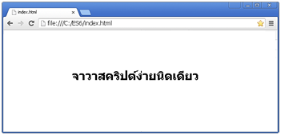
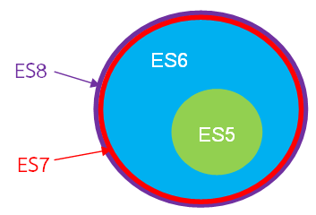
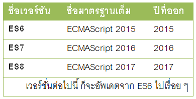

# สรุปเนื้อหาจากหนังสือ  "พัฒนาเว็บแอปพลิเคชั่นด้วย JavaScript"


## เนื้อหาเกี่ยวกับอะไร

เนื้อหาทั้งหมดต่อไปนี้จะสรุปเกี่ยวกับภาษาจาวาสคริปต์ (JavaScript) ยุคสมัยใหม่ตามมาตรฐาน ES6 จากหนังสือที่เห็นในรูปข้างต้นครับ (อาจไม่ละเอียดเท่าหนังสือ) รวมทั้งเพิ่มเนื้อหาที่ไม่อยู่ในหนังสือ เช่น ES7 และอื่นๆ อีกมากมาย ซึ่งตอนนี้ผมยังเขียนสรุปไม่เสร็จดี (เสร็จไปแค่ 1 %) ว่างๆ ก็จะมาอัพเดตใหม่เรื่อยๆ

*** ใครเอาเนื้อหาผมไปใช้ โปรดให้เครดิตลิงค์ต้นฉบับต้นด้วยนะคร๊าบบบบบ

ถ้าสนใจข่าวสารไอที ติดตามได้ที่เพจ

* https://www.facebook.com/programmerthai/

## ถ้าสนใจเล่มนี้สามารถสั่งซื้อได้ที่

* [ศูนย์หนังสือจุฬา]( http://www.chulabook.com/description.asp?barcode=9786160825394)
* [ร้านนายอินทร์](https://www.naiin.com/product/detail/191081/)
* [ร้าน Book Smile](http://www.booksmile.co.th/คอมพิวเตอร์อินเทอร์เน็ต/พัฒนาเว็บแอบพลิเคชั่นด้วย-JavaScript.html)
* [ร้าน kinokuniya thailand](https://thailand.kinokuniya.com/bw/9786160825394)
* [ผ่านฟ้าบุ๊คเซ็นเตอร์] (http://www.phanpha.com/item/พัฒนาเว็บแอปพลิเคชั่นด้วย-javascript)
* [ซีเอ็ดบางสาขา]( https://www.se-ed.com/product/พัฒนาเว็บแอปพลิเคชั่นด้วย-JavaScript.aspx?no=9786160825394)
* และร้านหนังสืออื่น ๆ ที่ไม่ได้กล่าว

## สารบัญ

* [บทที่ 1 แนะนำภาษาจาวาสคริปต์](#บทที่-1-แนะนำภาษาจาวาสคริปต์)
* [บทที่ 2]
* [บทที่ 3]

## บทที่ 1 แนะนำภาษาจาวาสคริปต์

### เกริ่นนำ

* ภาษาจาวาสคริปต์ (JavaScript) เป็นภาษาโปรแกรมเชิงวัตถุแบบไดนามิกไทป์ (Dynamic types) ซึ่งไวยากรณ์ของมันได้นำโครงสร้างมาจากภาษายอดนิยมอย่างจาวา (Java) กับภาษาซี (C) 

* โปรแกรมที่เขียนขึ้นด้วยจาวาสคริปต์ จะต้องทำงานอยู่บนจาวาสคริปต์เอ็นจิ้น (JavaScript engine) ที่เป็นทั้งตัวแปลภาษา (Interpreter) และใช้รันโปรแกรม สำหรับการทำงานของจาวาสคริปต์ที่เราคุ้นเคยกันดี จะทำงานอยู่บนเว็บเบราเซอร์ เช่น Google Chrome, Firefox และ Internet Explorer เป็นต้น ซึ่งจะมีจาวาสคริปต์เอ็นจิ้นติดตั้งมาให้อยู่แล้ว



* นักพัฒนาซอฟต์แวร์ส่วนใหญ่ล้วนรู้จักภาษาจาวาสคริปต์ ซึ่งถือว่านิยมใช้กันมากภาษาหนึ่งในโลก ถ้าศึกษาอย่างผิวเผินก็อาจคิดว่าง๊ายง่าย แต่เมื่อศึกษาลงลึก ๆ แล้ว จะพบว่ามันโคตรจะอินดี้ เป็นภาษาปราบเซียนตัวหนึ่ง จนคนไม่ค่อยเข้าใจกันมากเท่าไรนัก จนหารู้ไม่ว่ามันมีความสามารถแฝงที่ซ้อนเร้นอยู่เยอะเลย

* จาวาสคริปต์ไม่ใช่ภาษา Java นะครับ คนละภาษา (คนมักสับสนกัน) 


* คนส่วนใหญ่รู้แค่ว่าใช้จาวาสคริปต์ร่วมกับภาษา HTML (ปัจจุบันเวอร์ชั่น HTML5) กับ CSS (ปัจจุบันเวอร์ชั่น CSS3) เพื่อทำให้เว็บมันไดนามิก ฟุ้งฟิ้ง กรุ้งกิ๊ง (มันดังในฝั่ง Font-end มานาน)

* แต่ปัจจุบันนี้จาวาสคริปต์สมัยใหม่ มันก้าวหน้าไปไกลมาก ๆๆๆ เพราะสามารถทำงานอยู่ฝั่งเซิร์ฟเวอร์ได้ (Back-end) ด้วย Node.js แม้แต่เอาไปทำแอพบนโมบาย หรือแม้แต่โรบอท ก็ยังทำได้ด้วย ….อายย่ะ


* องค์กร Ecma International (องค์กรจัดการมาตรฐานแห่งยุโรป) เป็นผู้กำหนดมาตรฐานจาวาสคริปต์ ซึ่งจะเรียกมาตรฐานนี้ว่า “ECMA-262” ส่วนตัวภาษาจาวาสคริปต์นั้น ก็จะมีชื่อเรียกเต็มยศอย่างเป็นทางการว่า “ภาษา ECMAScript“


* ES6 (ECMAScript 2015) เป็นมาตรฐานใหม่ล่าสุดของจาวาสคริปต์ ประกาศออกมาเมื่อกลางเดือนมิถุนายนปี 2558 ซึ่งถือว่าเปลี่ยนแปลงเวอร์ชั่นครั้งใหญ่สุดในประวัติศาสตร์ของภาษานี้ หลังจากไม่ได้เปลี่ยนมาเกือบ 6 ปี (เวอร์ชั่นเก่าคือ ES5)


* ปีค.ศ. 2016 เวอร์ชั่นใหม่ ES7 (ECMAScript 2016) ก็ออกมาแหละ ส่วนปีหน้า 2017 ก็จะเป็นคิวของเวอร์ชั่น ES8 (ECMAScript 2017) จะออกมาเช่นกัน 

* ต้องเข้าใจอย่างนี้นะครัช เนื่อง ES6 มันใหญ่โตอลังการงานสร้างมาก คืนรอปล่อยออกมาหมดทีเดียว ก็คงรอหลายชาติภพ อาจทำให้มีเสียงบ่นตามมาได้ ด้วยเหตุนี้เข้าถึงเพิ่มฟีเจอร์เล็กยิบ ๆ ย่อย ๆ มาใส่ไว้ในเวอร์ชั่นหลัง ๆ แทน 

* โดยคาดว่าจากนี้ไป จะมีการประกาศเวอร์ชั่นใหม่ทุก ๆ ปี โดยให้คิดเสียว่า ES6 เหมือนโปรแกรมหลัก ส่วนเวอร์ชั่นที่ออกตามทีหลัง ไม่ได้ว่าจะเป็น ES7, ES8 และ ESXXXXX มันก็คือการอัพเดตซอฟต์แวร์ อะไรประมาณนี้



* API ที่ใช้ติดต่อกับ DOM หรือใช้งานร่วมกับ HTML5, CSS3 ใน ES6 เขาไม่ได้เปลี่ยนแปลงอะไรเลย

* ES6, ES7, ES8 มันเป็นแค่มาตรฐานใหม่สด ๆ ซิง ๆ ดังนั้นการใช้งานโดยตรงบนเว็บบราวเซอร์ (ปัจจุบันที่ผมเขียนอยู่นี้) ก็ยังไม่ support ทุกฟีเจอร์ ต้องมีตัวคอมไพล์ช่วยก่อน (ยังมีข้อจำกัดบางประการ) …หรือถ้าใครใช้ Node.js เวอร์ชั่น 6 ก็ยังรองรับ ES6 ได้แค่ 93 % (ES7 รองรับได้บางส่วน)




### เครื่องมือในการพัฒนา

สำหรับเครื่องมือพัฒนาภาษาจาวาสคริปต์ในท้องตลาดปัจจุบัน มีให้ใช้ฟรีหลายตัวมาก เช่น Sublime Text, Atom, Free JavaScript Editor, Aptana Studio, NetBeans, Eclipse ฯลฯ หรือแม้แต่ใช้อิดิเตอร์ธรรมดา เช่น Notepad, Notepad++ และ EditPlus เป็นต้น ก็สามารถใช้เขียนได้เช่นกัน

### Node.js มันคืออะไรตับไตใส้พุง?

ถ้าใครจับจาวาสคริปต์ยุคนี้ จะหนีไม่พ้นต้องรู้จัก Node.js …เอ๊ะ ว่าแต่มันคืออะไรล่ะ?

ถ้าอธิบายสั้นๆ มันคือตัวรันไทม์ (Runtime) ของภาษาจาวาสคริปต์ โดยที่เราไม่ต้องพึ่งพาเว็บบราวเซอร์เลย 

ด้วยเหตุนี้จึงสามารถรันจาวาสคริปต์นอกเว็บเบราเซอร์ได้ ซึ่งปัจจุบันเขานิยมนำ Node.js มาใช้งานฝั่งเซิร์ฟเวอร์ (Back-end) หรือจะทำงานตามลำพังเป็นแบบ Standalone ก็ย่อมได้นะลูกพี่

ถ้าสนใจเนื้อหาของ Node.js มากกว่านี้ ก็สามารถอ่าน ebook ที่ผมแจกฟรีได้ที่

* [วิธีติดตั้ง Node.js และ npm เบื้องต้น (Node.js เวอร์ชั่น 6)](http://ebooks.in.th/ebook/37385/วิธีติดตั้ง_Node.js_และ_npm_เบื้องต้น/)
* [Node.js เล่ม 1](http://www.ebooks.in.th/ebook/37714/เสียดายไม่ได้อ่าน_จาวาสคริปต์ฝั่งเซิร์ฟเวอร์_Node.js_(ฉบับย่อ)/)
* [Node.js เล่ม  2] (http://www.ebooks.in.th/ebook/37836/เสียดายไม่ได้อ่าน_จาวาสคริปต์ฝั่งเซิร์ฟเวอร์_Node.js_ฉบับย่อ_เล่ม2)
* [การใช้งาน MongoDB เบื้องต้น (แถมให้อีกอัน)](http://www.ebooks.in.th/ebook/37861/การใช้งาน_MongoDB_เบื้องต้น/)

*** ต้องสมัครเป็นสมาชิกของ http://www.ebooks.in.th ถึงจะโหลด PDF ได้

###  ตัวอย่างจาวาสคริปต์บนเว็บเบราเซอร์ 

ตัวอย่างต่อไปนี้จะแสดงการเขียนจาวาสคริปต์ตามมาตรฐานเก่า ES5 ซึ่งจะต้องแทรกอยู่ภายใต้แท็ก < script > ...< /script > ของไฟล์ HTML โดยทั้งนี้จะสมมติว่าบันทึกเป็นไฟล์ index.html

*** ผมขอติ้งต่างว่า คุณเขียนจาวาสคริปต์บน HTML เป็นกันอยู่แล้วเนอะ

```js
<!-- ไฟล์ชื่อ index.html-->
<!DOCTYPE html>
<html>
<head></head>
<body>
	<h1 id="element1"></h1>
	<script>		
		// ซอร์สโค้ดตามมาตราฐานเก่า ES5   
		function say(message){
	    		var element = document.querySelector('#element1');
	    		element.innerHTML = message;			
		}
		say("Hello, world!");
</script>
</body>
</html>
```

โครงสร้างโปรเจค

```js
C:\ES6>
    |-- index.html
```

เมื่อดับเบิลคลิกที่ไฟล์ index.html จะปรากฏตามรูป


### ตัวอย่างจาวาสคริปต์นอกเว็บเบราเซอร์

ต่อไปจะแสดงการใช้งานจาวาสคริปต์นอกเว็บเบราเซอร์ ด้วยการใช้ Node.js รันไฟล์จาวาสคริปต์ในฝั่งเซิร์ฟเวอร์

```js
var http = require('http');

http.createServer(function (request, response) {
  response.writeHead(200, {'Content-Type': 'text/plain'});
  response.end("Hello, world!");
}).listen(8001, '127.0.0.1');

console.log('Server running at http://127.0.0.1:8001/');
```

ซอร์สโค้ดข้างบน อย่าเพิ่งสนใจรายละเอียดนะครับ (มันนอกประเด็น) แต่จะสมว่าบันทึกเป็นไฟล์ server.js ดังโครงสร้างโปรเจคต่อไปนี้

```js
C:\ES6>
    |-- server.js
```

รันไฟล์ server.js ผ่านทาง Node.js ด้วยความสั่งต่อไปนี้  ตามรูป


*** อ่านวิธีติดตั้ง และใช้งาน Node.js เพิ่มเติม ได้จากหนังสือที่ผมแจกฟรีข้างต้นนะครับ

เมื่อเปิดเว็บเบราเซอร์แล้วกรอก URL เป็น http://127.0.0.1:8001/ ก็จะเห็นข้อความ Hello, world! แสดงออกมาทางหน้าเว็บเพจ ตามรูป


### ตัวอย่างการเขียน ES6 กับ ES7 บนเว็บเบราเซอร์

เนื่องจากตอนที่ผู้เขียนแต่งหนังสือ มาตรฐาน ES6 เพิ่งออกมาใหม่ และเว็บเบราเซอร์ส่วนใหญ่จะใช้งานได้กับ ES5 ด้วยเหตุนี้จึงต้องนำซอร์สโค้ดที่เขียนด้วย ES6 มาคอมไพล์ ด้วยคอมไพเลอร์ที่เรียกว่า “transpiler” เพื่อแปลงจาก ES6 ให้กลายมาเป็นเวอร์ชั่น ES5 ที่เว็บเบราเซอร์ส่วนใหญ่ใช้งานได้ไปก่อน

โดยตัวอย่างต่อไปนี้จะแสดงการเขียนจาวาสคริปต์บนเว็บเบราเซอร์ โดยใช้ Traceur ทำตัวเป็น transpiler (อย่าเพิ่งสนใจรายละเอียดซอร์สโค้ดที่ยกมาให้ดูนะครับ)

```js
<!-- ไฟล์ index.html-->
<!DOCTYPE html>
<html>
<head>

<!--  Traceur (ใช้เป็นตัว transpiler)-->
<script src="https://google.github.io/traceur-compiler/bin/traceur.js"></script>
<script src="https://google.github.io/traceur-compiler/bin/BrowserSystem.js"></script>
<script src="https://google.github.io/traceur-compiler/src/bootstrap.js"></script>

</head>
<body>
<h1 id="element1"></h1>
<script type="module">						// ต้องเขียนกำกับ type = "module"
	class Chat{								// class ไวยากรณ์ใหม่ของ ES6
		constructor(message) {				// constructor ไวยากรณ์ใหม่ของ ES6
			this.message = message;
		}
		say(){
			let element = document.querySelector('#element1');
			element.innerHTML = this.message;				
		}
	}		
	let chat = new Chat("Hello, world!");	// let ไวยากรณ์ใหม่ของ ES6
	chat.say();

	let array = ["A", "B", "C"];			// let ไวยากรณ์ใหม่ของ ES6
	console.log(array.includes("A"));   	// true    -- เมธอดของอาร์เรย์ที่เพิ่มเข้ามาใน ES7
</script>
</body>
</html>
```

จะสมมติว่าบันทึกเป็นไฟล์ index.html โดยมีโครงสร้างโปรเจคดังนี้

```js
C:\ES6>
    |-- index.html
```

เมื่อดับเบิลคลิกที่ไฟล์ index.html จะปรากฏตามรูป


*** Traceur ที่เห็นเป็นของ Google แต่ทั้งนี้ปัจจุบันตัว transpiler ก็มีหลายเจ้าให้เลือก (ผมแสดงให้ดูแค่เจ้าเดียวครับ) ซึ่งเท่าที่ผมลองใช้งานดูหลายเจ้า มันก็ยังไม่นิ่งเท่าไร ถ้าจะนำมันไปใช้งานยังไง ก็ควรหมั่นอัพเดตจากทีมสร้างเขาอีกทีนะครับ ...ที่สำคัญวิธีใช้งานแต่ละเจ้า ก็ดันแตกต่างกันอีกแฮะ!

จนหนังสือที่ผมเขียนไป ถ้าใครลองทำตาม แล้วใช้งาน ES6 ไม่ได้ เค้าขอโทษแล้วกันน๊า! ยังไงเดี่ยวขออัพเดตโค้ดล่าสุดที่เว็บนี้แล้วกันเนอะ

### ตัวอย่างการเขียน ES6 กับ ES7 บน Node.js

ต่อไปจะแสดงการเขียนจาวาสคริปต์ด้วย ES6 กับ ES7 แล้วสั่งรันผ่านทาง Node.js โดยตรง ไม่ต้องใช้  transpiler (หรือจะใช้ ก็แล้วแต่ครับ)

*** ทั้งนี้ Node.js ตอนที่ผมเขียนหนังสือ มันรองรับ ES6 ได้แค่ 93 % (เศร้ากันไหม?)

*** ส่วน ES7 ก็ยังรองรับได้ไม่เต็มที่

```js
class Chat{                 			// class ไวยากรณ์ใหม่ของ ES6
    constructor(message) {      		// constructor ไวยากรณ์ใหม่ของ ES6
        this.message = message;
    }
    say(){
        console.log(this.message);
    }
}       
let chat = new Chat("Hello, world!");   // let ไวยากรณ์ใหม่ของ ES6
chat.say();                 			// "Hello, world!"
let array = ["A", "B", "C"];
console.log(array.includes("A"));   	// true    -- เมธอดของอาร์เรย์ที่เพิ่มมาใน ES7
```

จะสมมติว่าบันทึกเป็นไฟล์ test.js โดยมีโครงสร้างโปรเจคดังนี้

```js
C:\ES6>
    |-- test.js
```

รันไฟล์ test.js ผ่านทาง Node.js ด้วยความสั่งต่อไปนี้ ตามรูป


## บทที่ 2

## บทที่ 3


## บทที่ 17

## อ้างอิง

* https://developer.mozilla.org/en-US/docs/Web/JavaScript/
* https://github.com/nzakas/understandinges6/blob/master/manuscript/B-ECMAScript-7.md
* https://tc39.github.io/ecma262/2016/


